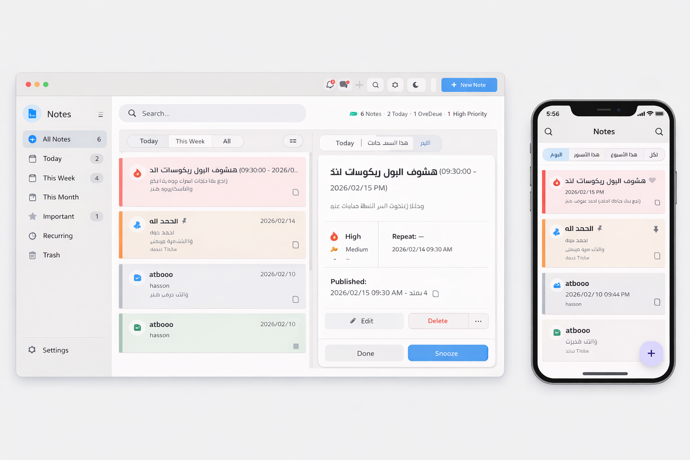
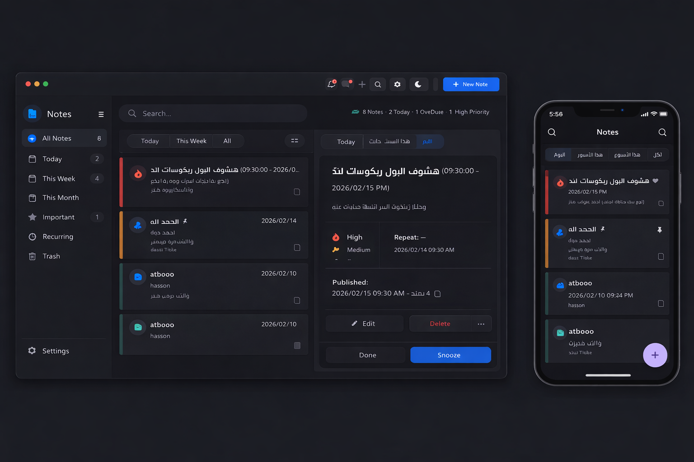

# 📌 Task Reminder App

A cross-platform Task Management application built with **Flutter**.
The app allows users to create tasks with scheduled notifications and works on both **Android** and **Desktop**.

---

## ✨ Features

* ✅ Create, edit, and delete tasks
* 🔔 Local notifications (WhatsApp-style alerts)
* 🌙 Dark / Light mode support
* 💾 Local database using SQLite
* 🖥️ Desktop support
* 📱 Android support
* 🎨 Custom app icon
* 🌐 Multilingual Support (English & Arabic)

---

## 🌐 Multilingual Support

The app now supports **two languages**:

* 🇬🇧 **English**
* 🇪🇬 **Arabic**

Users can switch between languages, and all app texts, labels, and buttons will update accordingly.

---

## 📸 Screenshots

### App Icon


### Main Screen 1


### Main Screen 2


---

## 🛠️ Built With

* Flutter
* Dart
* flutter_local_notifications
* sqflite
* flutter_launcher_icons

---

## 🚀 Getting Started

### 1️⃣ Clone the repository

```bash
git clone https://github.com/mr-atbooo/fluter_note_course.git
```

### 2️⃣ Install dependencies

```bash
flutter pub get
```

### 3️⃣ Run the app

```bash
flutter run
```

---

## 🔔 Notifications

The app uses local notifications to remind users about tasks.
Notifications appear like messaging apps (not full alarm mode).

---

## 📂 Project Structure

```
lib/
 ├── models/
 ├── screens/
 ├── services/
 ├── db/
 └── main.dart
```

---

## 🎯 Future Improvements

* ⏰ Full Alarm mode (like Clock app)
* ☁️ Cloud sync
* 👥 User authentication
* 📊 Task statistics

---

## 👨‍💻 Author

Developed by **Mohamed Abd ElAziz El Atbany**

---

## 📜 License

This project is open-source and available under the MIT License.
